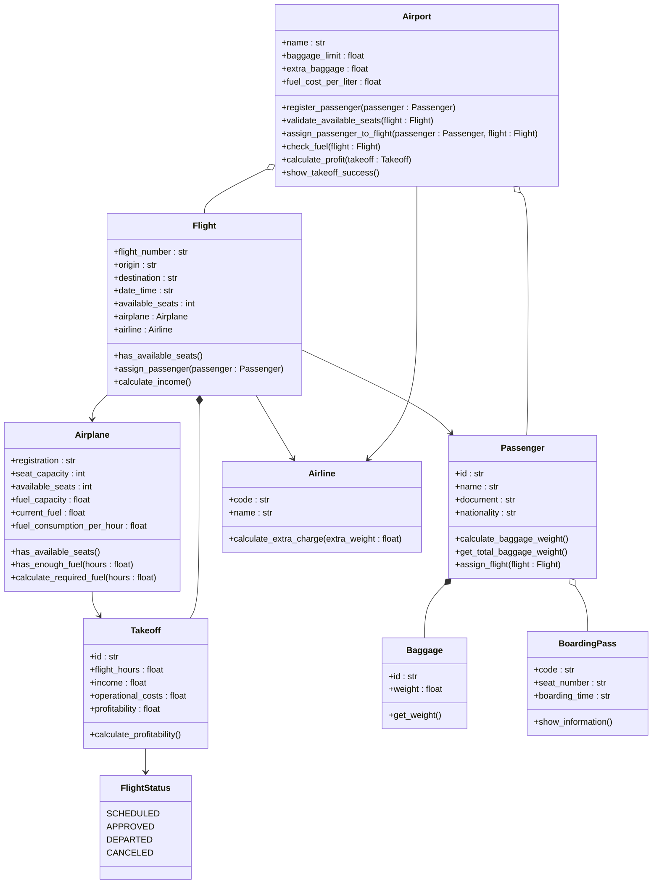

# ProyectoPOO

# Proyecto de programación orientada a objetos

## Tabla de contenidos

* [Definición de alternativa](#definición-de-alternativa)
* [Diagrama UML](#diagrama-uml)
* [Explicación de Objetos, Atributos y Métodos](#explicación-de-objetos-atributos-y-métodos)
* [Solución preliminar](#solución-preliminar)

---

# Definición de alternativa

Un aeropuerto internacional necesita un sistema para administrar el registro de pasajeros, recursos, gastos y ganancias del aeropuerto. Para ello, se requiere lo siguiente:

1. El sistema debe registrar a los pasajeros y calcular el peso de sus maletas. Si el equipaje excede el límite permitido por la aerolínea, se debe generar un cobro adicional automático.

2. Se debe validar si hay asientos disponibles en el avión. Si hay disponibles, se genera el pase de abordar. Si no, el sistema debe ofrecer una reprogramación automática asignando al pasajero al siguiente vuelo disponible.

3. Revisar y calcular si la gasolina actual del avión es suficiente para llegar al destino.

4. Calcular la rentabilidad de cada despegue. El sistema debe sumar los ingresos y restarle los gastos operativos.

5. Si el vuelo es aprobado para despegar, se debe mostrar en pantalla que fue un éxito.

---

# Diagrama UML



# Explicación de Objetos, Atributos y Métodos

## Airport

Clase principal encargada de administrar el sistema aeroportuario.

### Atributos

* `name` → Nombre del aeropuerto.
* `baggage_limit` → Peso máximo permitido de equipaje.
* `extra_baggage_fee` → Costo por exceso de equipaje.
* `fuel_cost_per_liter` → Precio del combustible por litro.

### Métodos

* `register_passenger()` → Registra pasajeros en el sistema.
* `validate_available_seats()` → Verifica disponibilidad de asientos.
* `assign_passenger_to_flight()` → Asigna pasajeros a vuelos.
* `generate_boarding_pass()` → Genera el pase de abordar.
* `check_fuel()` → Valida combustible suficiente.
* `calculate_profit()` → Calcula rentabilidad del vuelo.
* `show_takeoff_success()` → Muestra confirmación de despegue exitoso.

---

## Passenger

Representa a un pasajero dentro del aeropuerto.

### Atributos

* `id` → Identificador del pasajero.
* `name` → Nombre del pasajero.
* `document` → Documento de identidad o pasaporte.
* `nationality` → Nacionalidad del pasajero.

### Métodos

* `calculate_baggage_weight()` → Calcula peso del equipaje.
* `get_total_baggage_weight()` → Obtiene peso total del equipaje.
* `assign_flight()` → Asigna un vuelo al pasajero.

---

## BoardingPass

Representa el pase de abordar del pasajero.

### Atributos

* `code` → Código del pase de abordar.
* `seat_number` → Número del asiento.
* `boarding_time` → Hora de abordaje.

### Métodos

* `show_information()` → Muestra la información del pase de abordar.

---

## Baggage

Representa el equipaje del pasajero.

### Atributos

* `id` → Identificador del equipaje.
* `weight` → Peso del equipaje.

### Métodos

* `get_weight()` → Devuelve el peso del equipaje.

---

## Airline

Representa la aerolínea operadora.

### Atributos

* `code` → Código de la aerolínea.
* `name` → Nombre de la aerolínea.

### Métodos

* `calculate_extra_charge()` → Calcula cobros por exceso de equipaje.

---

## Flight

Representa un vuelo programado.

### Atributos

* `flight_number` → Número identificador del vuelo.
* `origin` → Lugar de salida.
* `destination` → Lugar de destino.
* `date_time` → Fecha y hora del vuelo.
* `available_seats` → Cantidad de asientos disponibles.

### Métodos

* `has_available_seats()` → Verifica disponibilidad de asientos.
* `assign_passenger()` → Agrega pasajeros al vuelo.
* `calculate_income()` → Calcula ingresos generados.

---

## Airplane

Representa el avión utilizado en los vuelos.

### Atributos

* `registration` → Matrícula del avión.
* `seat_capacity` → Capacidad máxima de pasajeros.
* `available_seats` → Asientos libres.
* `fuel_capacity` → Capacidad máxima de combustible.
* `current_fuel` → Combustible disponible actualmente.
* `fuel_consumption_per_hour` → Consumo de combustible por hora.

### Métodos

* `has_available_seats()` → Verifica asientos libres.
* `has_enough_fuel()` → Comprueba combustible suficiente.
* `calculate_required_fuel()` → Calcula combustible necesario.

---

## Takeoff

Representa la operación de despegue.

### Atributos

* `id` → Identificador del despegue.
* `flight_hours` → Duración estimada del vuelo.
* `income` → Ingresos del vuelo.
* `operational_costs` → Gastos operativos.
* `profitability` → Ganancia obtenida.

### Métodos

* `calculate_profitability()` → Calcula la rentabilidad del vuelo.

---

## FlightStatus

Enumeración que representa el estado del vuelo.

### Valores

* `SCHEDULED` → Vuelo programado.
* `APPROVED` → Vuelo aprobado.
* `DEPARTED` → Vuelo despegado.
* `CANCELED` → Vuelo cancelado.

---

# Solución preliminar

```text
==============================
        AIRPORT SYSTEM
==============================

Passenger registered successfully

Passenger : Andres Perez
Document  : CC 123456

Checking baggage weight...
Total baggage weight : 32 kg
Extra baggage charge : $40

Checking available seats...
Seat assigned : 14A

Generating boarding pass...

==============================
        BOARDING PASS
==============================

Passenger : Andres Perez
Flight    : AV203
Origin    : Bogotá
Destination : Madrid
Seat      : 14A

Checking airplane fuel...
Fuel status : OK

Calculating flight profitability...
Flight profitability : $185000

FLIGHT DEPARTED SUCCESSFULLY
==============================
