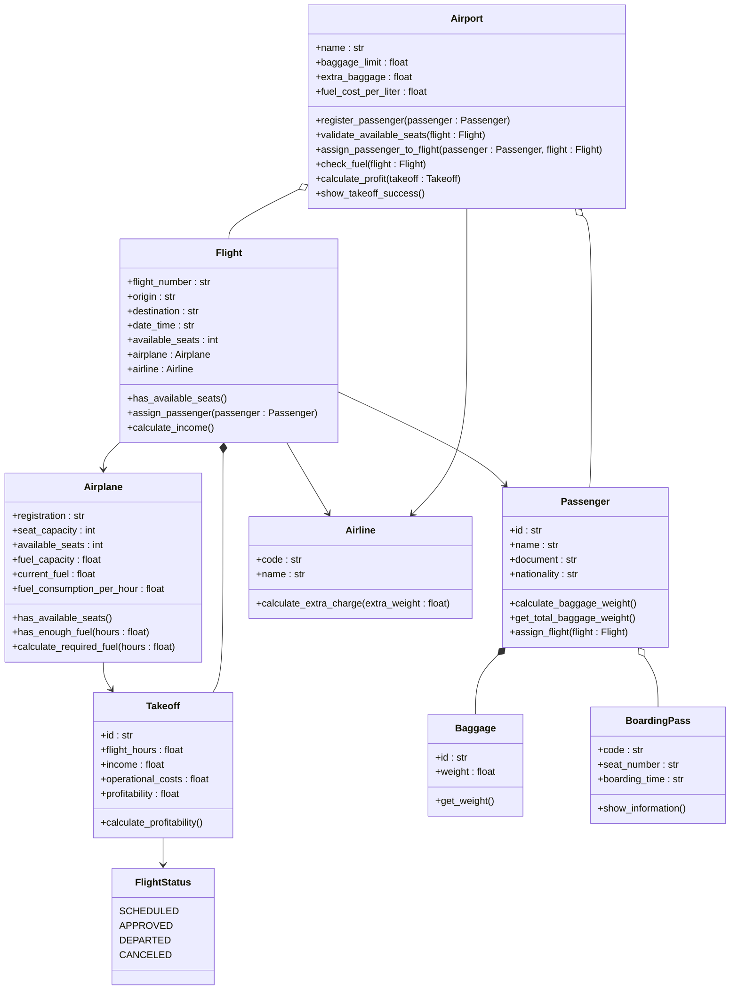

# ProyectoPOO

# Proyecto de programación orientada a objetos

## Tabla de contenidos

* [Definición de alternativa](#definición-de-alternativa)
* [Diagrama UML](#diagrama-uml)
* [Solución preliminar](#solución-preliminar)

---

# Definición de alternativa

Un aeropuerto internacional necesita un sistema para administrar el registro de pasajeros, recursos, gastos y ganancias del aeropuerto. Para ello, se requiere lo siguiente:

1. El sistema debe registrar a los pasajeros y calcular el peso de sus maletas. Si el equipaje excede el límite permitido por la aerolínea, se debe generar un cobro adicional automático.

2. Se debe validar si hay asientos disponibles en el avión. Si hay disponibles, se genera el pase de abordar. Si no, el sistema debe ofrecer una reprogramación automática asignando al pasajero al siguiente vuelo disponible.

3. Revisar y calcular si la gasolina actual del avión es suficiente para llegar al destino.

4. Calcular la rentabilidad de cada despegue. El sistema debe sumar los ingresos y restarle los gastos operativos.

5. Si el vuelo es aprobado para despegar, se debe mostrar en pantalla que fue un éxito.

---

# Diagrama UML



---

# Solución preliminar

```text
==============================
        AIRPORT SYSTEM
==============================

Passenger registered successfully

Passenger : Andres Perez
Document  : CC 123456

Checking baggage weight...
Total baggage weight : 32 kg
Extra baggage charge : $40

Checking available seats...
Seat assigned : 14A

Generating boarding pass...

==============================
        BOARDING PASS
==============================

Passenger : Andres Perez
Flight    : AV203
Origin    : Bogotá
Destination : Madrid
Seat      : 14A

Checking airplane fuel...
Fuel status : OK

Calculating flight profitability...
Flight profitability : $185000

FLIGHT DEPARTED SUCCESSFULLY
==============================
